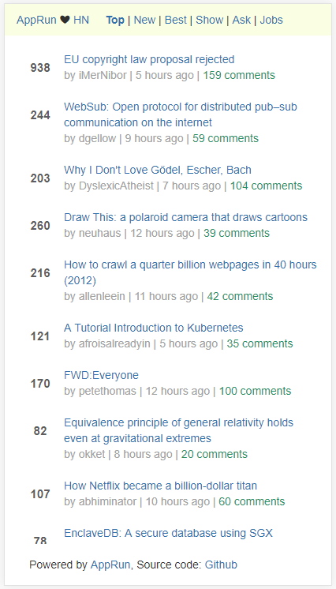

# apprun-hn

This is a Hacker News reader application built using [AppRun](https://github.com/yysun/apprun),
a library for developing applications using the elm architecture, events, and components.




### Demo

https://yysun.github.io/apprun-hn

### Develop
```
npm install
npm start
```

Have fun.

## License

MIT

Copyright (c) 2015-2018 Yiyi Sun
